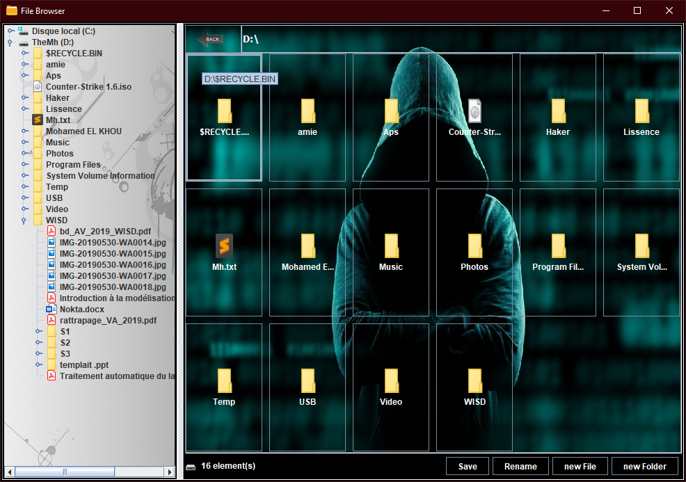

# FileBrowser
> Writing a simple file browser in Java SWING

Screenshots of the application can be found in the [Wiki page](https://github.com/m-elkhou/FileBrowser/wiki).

***
### Links
- [E-mail : ](mailto:m.elkhou@hotmail.com) m.elkhou@hotmail.com
- [Linkedin](https://www.linkedin.com/in/m-elkhou/)
- [GitHub](https://github.com/m-elkhou)

